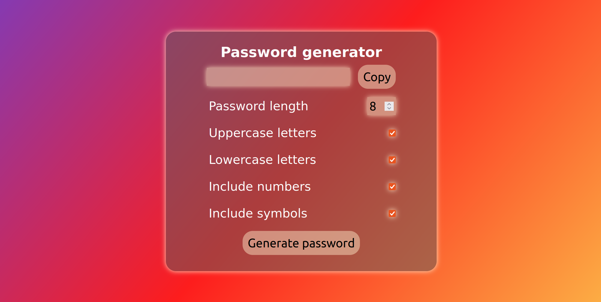
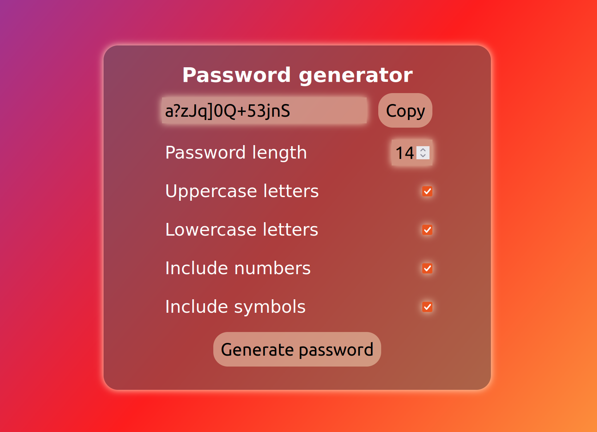

# Password generator



## Usage

You can choose how your password looks using checkboxes, specify a length and easely copy it.



## Installation on your local machine

```
git init
git clone -b master https://github.com/Krzesimir04/react_password_generator
cd react_password_generator
npm install
npm start
```
## Additional information

- One checkbox is always checked
- minimum length of password is 8 chars, maximum is 40